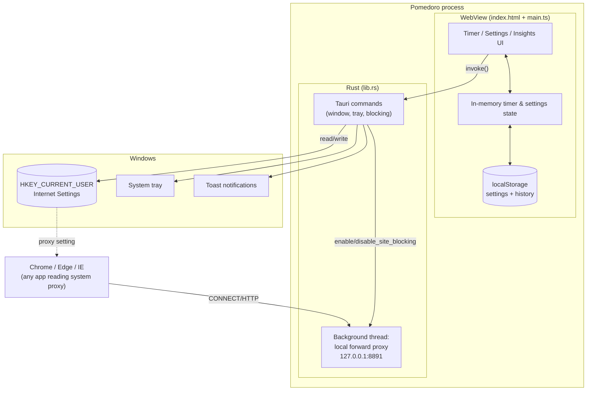

# Pomedoro — Architecture & Code Walkthrough

This document explains how Pomedoro is built, why it's built that way, and walks through
every source file. It's meant for anyone (including future-you) picking up the codebase
cold.

## Table of contents

1. [Language & framework choices](#language--framework-choices)
2. [Project structure](#project-structure)
3. [High-level architecture](#high-level-architecture)
4. [Rust backend walkthrough (`src-tauri/`)](#rust-backend-walkthrough-src-tauri)
5. [Frontend walkthrough (`src/`)](#frontend-walkthrough-src)
6. [The IPC boundary: how frontend and backend talk](#the-ipc-boundary-how-frontend-and-backend-talk)
7. [Data persistence](#data-persistence)
8. [Build & tooling](#build--tooling)
9. [Design decisions and rejected approaches](#design-decisions-and-rejected-approaches)

---

## Language & framework choices

| Layer | Choice | Why |
|---|---|---|
| Application shell | **Tauri 2** | Native window/tray/OS integration with a fraction of Electron's footprint — the whole app is a ~3MB executable with near-zero idle CPU/RAM, which matters for something meant to sit in a screen corner all day. |
| Backend logic | **Rust** | Tauri's native language; also genuinely needed here — the site-blocking feature runs a raw TCP proxy and touches the Windows registry, which wants a systems language with direct OS API access (`winreg`, `windows` crates) rather than a scripting layer. |
| Frontend UI | **Vanilla TypeScript + Vite**, no framework | The UI is a handful of views (timer, settings tabs) with straightforward DOM updates — a framework's reactivity system would add bundle size and abstraction for no real benefit at this scale. Vite gives fast HMR in dev and a tiny, dependency-free production bundle (~12KB JS, ~9KB CSS). |
| Styling | **Plain CSS**, no preprocessor/framework | Small enough surface area that a design-token `:root` block plus BEM-ish class names is more maintainable than pulling in Tailwind/Sass for a few hundred lines of CSS. |

The net effect: `npm install` pulls in exactly two runtime dependencies
(`@tauri-apps/api`, `@tauri-apps/plugin-notification`), and the Rust side has a small,
auditable dependency list (see `src-tauri/Cargo.toml`). Release builds use
`lto = true`, `strip = true`, `opt-level = "s"`, `codegen-units = 1` — the resulting
`pomedoro.exe` is ~3MB.

## Project structure

```
pomedoro/
├── index.html              # Single HTML shell - all views live in here, toggled via CSS classes
├── src/
│   ├── main.ts              # All frontend logic (state, timer, settings, insights, wiring)
│   └── style.css             # All styling (design tokens, layout, components)
├── src-tauri/
│   ├── src/
│   │   ├── main.rs           # Entry point - just calls into lib.rs
│   │   └── lib.rs             # All backend logic (commands, tray, proxy, registry)
│   ├── capabilities/
│   │   └── default.json      # Tauri v2 permission grants for the main window
│   ├── icons/                 # App icons (generated by scripts/generate-icons.ps1)
│   ├── Cargo.toml             # Rust dependencies + release profile tuning
│   ├── build.rs                # Tauri's codegen entry point
│   └── tauri.conf.json         # Window config, bundle targets, app identifier
├── scripts/
│   └── generate-icons.ps1     # One-off PowerShell/GDI+ icon generator (no external tools needed)
├── docs/screenshots/           # README screenshots
├── package.json / vite.config.ts / tsconfig.json   # Frontend tooling
└── README.md / ARCHITECTURE.md / LICENSE
```

Notably, there is **no framework-driven file-per-component split**. `main.ts` (≈760
lines) and `style.css` (≈600 lines) hold everything for the frontend; `lib.rs` (≈420
lines) holds everything for the backend. At this size, splitting further would mean
more files to jump between for less benefit — the code is organized internally with
`// ---------- section ----------` banner comments instead (see the walkthroughs below).

## High-level architecture



Two things worth noting from this diagram:

- **The timer itself lives entirely in the frontend.** `main.ts` runs a plain
  `setInterval`-driven countdown computed from wall-clock timestamps (see
  [Frontend walkthrough](#frontend-walkthrough-src)). Rust is only involved for things
  the browser sandbox can't do: window geometry, the tray icon, native notifications,
  and the site-blocking proxy/registry work.
- **The site-blocking proxy is a separate concern from the frontend entirely.** It's a
  background OS thread inside the same process, started once at app launch and left
  running for the app's whole lifetime (see [below](#site-blocking-proxy)).

## Rust backend walkthrough (`src-tauri/`)

### `main.rs`

```rust
#![cfg_attr(not(debug_assertions), windows_subsystem = "windows")]

fn main() {
    pomedoro_lib::run();
}
```

The `windows_subsystem = "windows"` attribute (release builds only) suppresses the
console window that would otherwise flash on launch. All real logic lives in `lib.rs`,
compiled as a separate library crate (`pomedoro_lib`) — this is the standard Tauri 2
project shape, which exists so mobile targets can share the same `run()` entry point.

### `lib.rs` — window & session commands

Six small `#[tauri::command]` functions handle everything the frontend can't do itself
because it's sandboxed inside a webview:

| Command | Purpose |
|---|---|
| `set_always_on_top` | Toggles the pin button's state |
| `hide_window` / `show_window` | Minimize-to-tray and restore |
| `quit_app` | Calls `app.exit(0)` — the only path that actually terminates the process |
| `flash_window` | Calls `request_user_attention(Critical)`, which flashes the taskbar entry until the window regains focus — used when a session completes |
| `toggle_compact` | Resizes/repositions the OS window between the full 380×580 view and the 96×96 (1×1 inch) compact widget |

`toggle_compact` is the most involved of these — it reads the *current monitor's*
scale factor and physical position/size, converts everything to logical pixels, and
computes a bottom-right corner position with a 14px margin:

```rust
let x = m_logical_x + m_logical_w - COMPACT_SIZE - COMPACT_MARGIN;
let y = m_logical_y + m_logical_h - COMPACT_SIZE - COMPACT_MARGIN;
```

Using `LogicalSize` (rather than physical pixels) for `COMPACT_SIZE = 96.0` is what
makes the widget a *true* 1×1 inch square regardless of Windows display scaling —
Tauri scales logical units by the monitor's DPI factor automatically, and 96 logical
px/inch is the Windows baseline.

### `lib.rs` — the tray icon

Built in the `.setup()` closure via `TrayIconBuilder`: a two-item menu (Show / Quit),
left-click toggles window visibility, right-click shows the menu (the default
`tray-icon` crate behavior when `show_menu_on_left_click(false)` is set). Closing the
window via the app's own UI never actually quits — `on_window_event` intercepts
`CloseRequested` and calls `window.hide()` + `api.prevent_close()` instead, so the
timer keeps running in the background. `quit_app` (wired to the tray's "Quit" item and
the in-app ✕ button) is the only way to really exit.

### `lib.rs` — site-blocking proxy {#site-blocking-proxy}

This is the largest and most interesting part of the backend. The design goal: block a
user-configured list of domains while a focus session is running, **without ever
requiring administrator privileges**. See
[Design decisions](#design-decisions-and-rejected-approaches) for what was tried and
rejected before landing here.

**The mechanism, in three pieces:**

1. **A local forward proxy** (`start_proxy_server`) — a background OS thread that binds
   `TcpListener` on `127.0.0.1:8891` for the whole app lifetime and spawns one thread
   per incoming connection (`handle_proxy_connection`). It's a classic thread-per-
   connection blocking-IO proxy — appropriate here because traffic volume is low
   (personal browser use) and it keeps the dependency list small (no async runtime
   needed).

   For each connection, `parse_target` reads just enough of the first request to
   extract the destination host — either from an HTTP `CONNECT host:port` line (used
   by browsers for HTTPS) or from a plain HTTP request's `Host:` header. Critically,
   **the proxy never decrypts HTTPS** — for a `CONNECT`, it just replies
   `200 Connection Established` and then splices raw bytes bidirectionally between the
   client and the real upstream server with `std::io::copy` running in both directions
   on separate threads. It only ever *looks at* the hostname being connected to, never
   the encrypted payload.

   If the hostname matches the blocklist (`is_blocked` — exact match or subdomain
   match via `.ends_with(".{domain}")`), the proxy just returns `403 Forbidden` with a
   short plaintext body instead of opening the upstream connection.

2. **A per-user Windows proxy setting.** Browsers need to be told to actually route
   through `127.0.0.1:8891`. Rather than configuring each browser individually, the
   code writes to `HKEY_CURRENT_USER\...\Internet Settings` (`ProxyEnable`,
   `ProxyServer`, `ProxyOverride`) — the same registry values the Windows Settings UI
   and Internet Options control. **`HKEY_CURRENT_USER` never requires elevation**,
   unlike `HKEY_LOCAL_MACHINE` or system files — any process running as the logged-in
   user can write it. Chrome, Edge, and IE all read this value automatically (it's the
   Windows "system proxy" setting); Firefox has its own independent proxy
   configuration and needs a one-time manual "use system proxy" toggle.

   After writing, `notify_proxy_settings_changed` calls the WinINet API
   `InternetSetOptionW` with `INTERNET_OPTION_SETTINGS_CHANGED` and
   `INTERNET_OPTION_REFRESH` so already-running browser windows pick up the change
   immediately, without needing a restart.

3. **Crash-safe save/restore.** Before the registry is touched for the first time,
   `enable_site_blocking` reads whatever proxy configuration the user already had and
   writes it to a JSON file in the app's local data directory
   (`proxy_prev_state.json`) — *only* if that file doesn't already exist, so repeated
   enable calls don't overwrite the real "before Pomedoro touched anything" state with
   an already-modified one. `disable_site_blocking` reads that file back, restores the
   exact original values, and deletes the file.

   The crash-safety net: on **every app startup**, `restore_saved_proxy_state` runs
   unconditionally in `.setup()`. If the save file is still on disk — meaning the app
   was killed or crashed while blocking was active and never got to clean up — it
   silently restores the user's original settings before the window even opens. No
   user action needed, and no UAC prompt either, since it's all per-user registry
   access.

   Defense in depth: even in the hypothetical case where a restore step were somehow
   missed, the proxy's blocklist (`Arc<Mutex<HashSet<String>>>`, managed as Tauri
   state) is cleared independently of the registry values. An idle proxy with an empty
   blocklist is a transparent passthrough — harmless, not a stuck block.

The two commands exposed to the frontend are intentionally minimal:

```rust
enable_site_blocking(app, state, domains: Vec<String>) -> Result<(), String>
disable_site_blocking(app, state) -> Result<(), String>
```

### `lib.rs` — Focus Assist link

`open_focus_assist_settings` just shells out to `cmd /C start "" ms-settings:quiethours`
to open the Windows Settings app directly to the Focus Assist page. This exists because
there's no supported way for a third-party app to toggle another app's notifications
(see [Design decisions](#design-decisions-and-rejected-approaches)) — this is the
honest fallback: one click, fully reliable, not automatic.

## Frontend walkthrough (`src/`)

`main.ts` is organized top-to-bottom into clearly banner-commented sections. Reading
order matters here more than in the Rust file, since a lot of state is module-level
`let` bindings shared across functions (a deliberate choice for a UI this size — see
[Design decisions](#design-decisions-and-rejected-approaches)).

### Types & persistence (top of file)

```ts
interface Settings { workMin, shortMin, longMin, cyclesBeforeLong,
                      autoStart, sound, lockDuringFocus,
                      blockingEnabled, blockList }
interface DayRecord { pomodoros, focusMinutes }
type History = Record<string, DayRecord>   // date-key -> that day's totals
```

Both are persisted to `localStorage` as JSON (`pomedoro:settings`, `pomedoro:history`)
via tiny `load*`/`save*` functions that fail closed (any parse error just falls back to
defaults / an empty object, so a corrupted localStorage value can't crash startup).
`loadSettings` merges saved values over `DEFAULT_SETTINGS` with a spread, so adding a
new setting field later doesn't require a migration — old saved JSON just won't have
the new key, and the default fills in.

`History` is a flat map keyed by `YYYY-MM-DD` (via `dateKey`/`todayKey`), not a
today-only snapshot — this is what makes the Insights day/week/month charts and streak
calculation possible; every completed focus session calls `recordCompletion`, which
increments that day's entry (creating it if absent) and re-saves the whole map.

### Module-level state

```ts
let settings = loadSettings();
let history = loadHistory();
let sessionType: SessionType = "work";
let completedInCycle = 0;
let remainingSeconds = durationFor(sessionType);
let running = false;
let endTimestamp = 0;
let tickHandle: number | undefined;
```

### The timer engine

The countdown is **drift-free by construction**: rather than decrementing
`remainingSeconds` once per tick, `start()` records a target wall-clock timestamp
(`endTimestamp = Date.now() + remainingSeconds * 1000`), and every tick recomputes the
remaining time from `endTimestamp - Date.now()` (`currentRemaining()`). A `setInterval`
firing a few milliseconds late — which will happen eventually — never accumulates
error, because the displayed value is always derived fresh from real timestamps, not
incremented from the previous tick's value. The interval itself runs at 1000ms (one
wake per second), not faster, since the displayed value only changes once a second
anyway — the point made in the initial "performance efficient" brief.

State transitions (`start`, `pause`, `reset`, `skip`, `switchTo`, `onSessionComplete`)
all follow the same pattern: mutate state → `applySessionUI()` (updates tab
highlighting, accent color, session label) → `updateDisplay()` (time text + SVG ring
`stroke-dashoffset`) → `updateLockUI()` → `syncBlocking()`. The last two are how the
Focus Lock and site-blocking features stay in sync with the timer without those
features needing their own event system — every transition just re-derives their
on/off state from current `(running, sessionType, settings)`.

`onSessionComplete()` is the one transition with side effects beyond UI: if the
finished session was `"work"`, it calls `recordCompletion()` (Insights data), then
`celebrate()` — which plays a two-tone Web Audio chime (`playChime`, generated with
`OscillatorNode`, no audio asset files), triggers a full-screen CSS pulse
(`flashScreen`), invokes the Rust `flash_window` command (native taskbar flash), and
fires a native toast (`sendNotification` from the notification plugin, gated by a
permission check done once at startup in `init()`).

### Focus Lock

```ts
function isLocked(): boolean {
  return settings.lockDuringFocus && running && sessionType === "work";
}
```

`updateLockUI()` sets `.disabled` on a fixed list of buttons
(`lockableControls = [btnStart, btnReset, btnSkip, btnHide, btnSettings, btnClose]`)
based on that predicate, called after every state transition. Because it's re-derived
from scratch each time (rather than toggled incrementally), there's no way for the
lock state to drift out of sync with the actual timer state. Breaks are deliberately
excluded (`sessionType === "work"`) — the point is committing to a focus block, not
locking the whole app for the break afterward too.

### Site blocking sync

```ts
let blockActive = false;   // last state we told Rust about

function syncBlocking() {
  const shouldBlock = settings.blockingEnabled && settings.blockList.length > 0
                       && running && sessionType === "work";
  if (shouldBlock === blockActive) return;
  ...
  invoke(shouldBlock ? "enable_site_blocking" : "disable_site_blocking", ...)
}
```

The `blockActive` diff-check is deliberate: each Rust call touches the registry, which
is cheap but not free, and calling it redundantly on every tick (rather than only on
actual state changes) would be wasteful for no benefit. Same call pattern as
`updateLockUI` — invoked from every state-transition function, always re-deriving the
target state from scratch rather than being toggled by name.

### Insights: buckets, streaks, chart

Three bucketing functions (`dayBuckets`, `weekBuckets`, `monthBuckets`) each return an
array of `{ label, minutes }`, reading from the `history` map for however many
trailing periods the view needs (7 days / 8 weeks / 6 months). `renderChart()` then
builds the bar chart as raw SVG — no charting library — computing each bar's height as
a fraction of the period's max value, with `barPath()` generating an SVG path string
that gives rounded top corners but a square bottom edge (the bar sits flush on its
baseline, only the "far" end is rounded, per standard bar-chart mark conventions).

`computeStreaks()` walks the `history` map's keys backward from today (or yesterday,
if today has no entry yet) counting consecutive days for the current streak, then
does a single forward pass over all sorted dates tracking the longest consecutive run
for the best streak.

### Settings modal

One overlay (`#settings-overlay`), four tab panels toggled by a shared
`switchSettingsTab(name)` that flips `.active`/`.hidden` classes based on
`data-tab`/`data-panel` attributes — no per-tab open/close functions. Opening the
modal (`openSettings()`) populates every field from current `settings` regardless of
which tab will be shown; saving (`saveSettingsFromModal()`) reads every field back in
one pass and persists the whole `Settings` object at once, so General and Distraction
fields save together even though they're visually on separate tabs. Switching *to* the
Insights tab specifically re-renders the chart and streak tiles
(`switchSettingsTab` has one special case for `"insights"`), since that data can go
stale while the modal is closed.

### `init()`

Runs once at the bottom of the file (`init();`). Sets up initial UI state, attaches
every event listener (buttons, tabs, keyboard shortcuts — Space to start/pause,
Escape to close the settings modal), and kicks off the async notification-permission
check. Nothing outside `init()` touches the DOM at load time — everything before it in
the file is function/type declarations only.

## The IPC boundary: how frontend and backend talk

The frontend calls Rust via `@tauri-apps/api/core`'s `invoke()`:

```ts
invoke("enable_site_blocking", { domains: settings.blockList })
```

which dispatches to the matching `#[tauri::command]` function registered in
`tauri::generate_handler![...]` inside `run()`. Two things worth knowing about this
boundary:

- **Custom commands (ours) don't need capability grants.** Tauri v2's permission
  system (`capabilities/default.json`) gates *built-in* and *plugin* commands (window
  manipulation via the JS API directly, notifications, etc.) — but since this app does
  all window/tray/blocking work through its own Rust commands rather than calling
  Tauri's JS window API directly, the only entries needed in `capabilities/default.json`
  are `core:default`, `core:window:allow-start-dragging` (for the frameless
  `data-tauri-drag-region` title bar — this specific permission isn't in the default
  set and has to be requested explicitly), and `notification:default` (for the one
  plugin actually used).
- **Every `invoke()` call in the frontend is wrapped in `.catch(() => {})`.** This is
  intentional, not sloppy error handling: if a Rust command fails (or — as happens
  during screenshot/testing in a plain browser tab with no Tauri backend at all —
  doesn't exist), the UI should degrade gracefully rather than throw and break the rest
  of `init()`'s event wiring. The synchronous DOM updates (e.g., toggling `.hidden` for
  compact mode) always happen *before* the `invoke()` call, so the UI still visually
  responds even if the native half fails.

## Data persistence

| What | Where | Why there |
|---|---|---|
| Settings (durations, toggles, block list) | `localStorage` (`pomedoro:settings`) | Simple, synchronous, scoped to the webview — no need for a Rust-side config file since nothing outside the webview needs to read it |
| Daily history (pomodoro counts, focus minutes) | `localStorage` (`pomedoro:history`) | Same reasoning; a flat date-keyed map is trivial to persist as JSON |
| Pre-blocking proxy state (for restore) | JSON file in Tauri's app-local-data directory | *Must* be readable by Rust on the next app startup even if the frontend never got to run (crash recovery), so it can't live in the webview's localStorage |

## Build & tooling

- **`vite.config.ts`** — fixed dev server port 1420 (required by Tauri's dev workflow),
  ignores `src-tauri/` in its file watcher (so Rust rebuilds don't also trigger a
  frontend reload storm), targets `chrome105` (WebView2's baseline).
- **`tauri.conf.json`** — declares the single main window (380×580, frameless,
  transparent background for the rounded-corner illusion, `alwaysOnTop: true` by
  default), and the bundle targets (`nsis`, `msi`) used by `cargo tauri build`.
- **`Cargo.toml` `[profile.release]`** — `lto = true`, `codegen-units = 1`,
  `opt-level = "s"` (optimize for size), `strip = true`, `panic = "abort"`. This is
  where the ~3MB executable comes from; none of it is default Cargo behavior.
- **`scripts/generate-icons.ps1`** — generates the app's PNG/ICO icon set from scratch
  using .NET `System.Drawing` (GDI+) primitives (gradient circle, ellipses, line
  strokes) rather than requiring an external image tool or a source artwork file. It
  also hand-assembles the multi-resolution `.ico` container format (ICONDIR +
  ICONDIRENTRY headers wrapping embedded PNGs) since .NET's `Icon` class only supports
  single-resolution icons directly.

## Design decisions and rejected approaches

Worth documenting because the reasoning isn't visible from the current code alone —
two earlier implementations of the site-blocking and notification-muting features were
built, tested, and deliberately thrown out:

**Site blocking, attempt 1: hosts file + elevated PowerShell.** The original design
edited `C:\Windows\System32\drivers\etc\hosts` (redirecting blocked domains to
`127.0.0.1`) via a UAC-elevated PowerShell subprocess spawned per enable/disable call.
This was abandoned after it corrupted the user's live hosts file — a rapid-fire
enable/disable sequence during dev-server iteration most likely raced two elevated
PowerShell processes against the same file. Beyond the bug, it had structural problems
independent of the crash: it required a UAC prompt that displayed as "Windows
PowerShell" wanting changes (not "Pomedoro"), and it modified a shared system file
that's easy to leave in a bad state if a write is interrupted. The current local-proxy
+ per-user-registry design (above) has no UAC prompts at all, never touches a file
outside the app's own data directory, and is restore-safe by construction (registry
writes are small, atomic-per-value operations — nothing to "corrupt" the way a
multi-line text file rewrite can be).

**Notification muting, attempt 1: undocumented WNF state toggling.** Windows Focus
Assist has no public API. There's a semi-well-known reverse-engineered technique
(`RtlPublishWnfStateData` from `ntdll.dll`, targeting a specific undocumented WNF
state-name constant) that several open-source "Focus Assist toggler" tools on GitHub
use. This was tested directly against the live `ntdll.dll` exports before writing any
Rust — and the publicly available state-name constant returned
`STATUS_INVALID_PARAMETER` on this Windows build even with the correct (case-sensitive)
export name. Given the technique is explicitly reverse-engineered, version-fragile,
and didn't verify as working, it was dropped in favor of the honest fallback:
`open_focus_assist_settings` opens the Settings page via the documented `ms-settings:`
URI scheme for the user to enable manually.

**Why module-level mutable state instead of a state container/store pattern in
`main.ts`.** With one view, one active timer, and no component tree, a Redux/store-style
indirection would add a layer of ceremony (actions, reducers, subscriptions) without
solving a problem the current code actually has — every state-changing function already
knows exactly which render functions to call afterward, and there's no cross-cutting
concern (undo, time-travel debugging, multiple independent consumers of the same
slice of state) that a store would earn its keep on.
