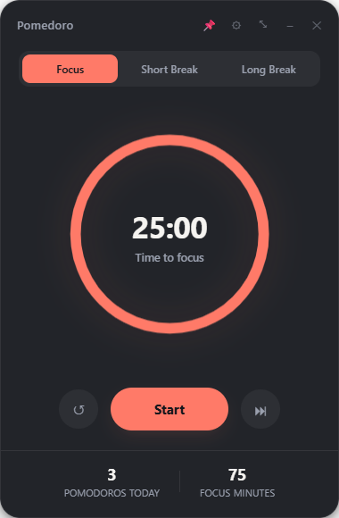
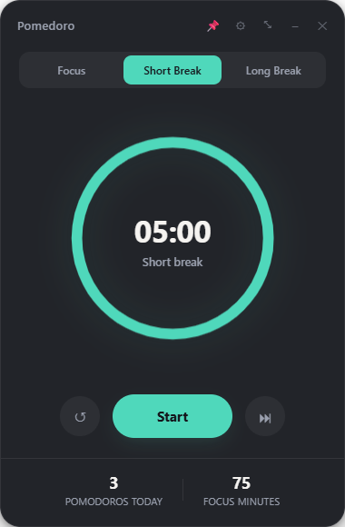
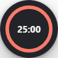
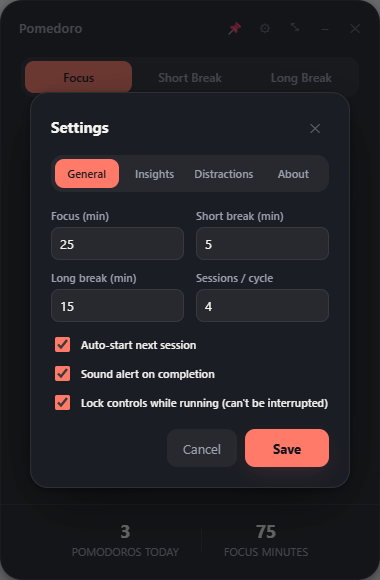
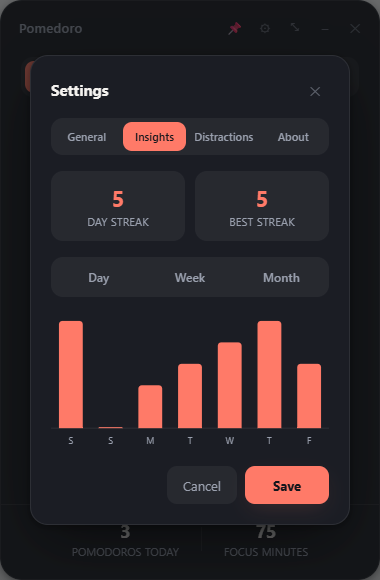
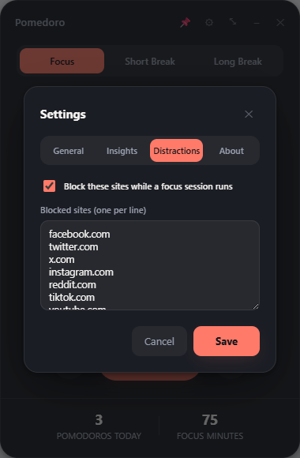
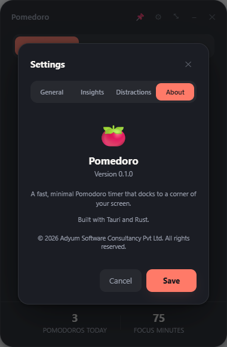

# Pomedoro

A fast, minimal Pomodoro timer for Windows that docks to a corner of your screen. Built with [Tauri](https://tauri.app) + Rust for a native, lightweight footprint (a few MB, near-zero idle CPU/RAM) with a polished, modern UI.

<p align="center">
  
  
  
</p>

## Features

- **Focus / Short Break / Long Break** cycle with configurable durations and auto-advance
- **Always-on-top**, frameless, rounded window that stays visible over other apps (pin toggle to turn off)
- **1×1 inch compact widget** that docks to a screen corner — a tiny always-on-top circular timer for when you don't need the full view
- **Native window flash + sound + Windows toast notification** when a session ends
- **System tray** — closing the window minimizes to tray instead of quitting, so the timer keeps running in the background
- **Focus lock** — optionally disable Pause/Reset/Skip/Minimize/Settings while a focus session is running, so you can't interrupt yourself
- **Insights** — day/week/month bar chart of focus minutes, plus current/best streak tracking
- **Distraction blocking** — block a configurable list of sites while a focus session runs, via a local proxy and a per-user Windows setting (no admin rights required, fully reversible, crash-safe)

## Screenshots & key settings

### Timer

The main view shows a circular countdown, session tabs (Focus / Short Break / Long Break), and today's stats. Each session type has its own accent color.

<p align="center"></p>

### General settings — durations, auto-start, and Focus Lock

Configure session lengths and how many focus sessions happen before a long break. **Focus Lock** is the standout setting here: turn it on and Pause/Reset/Skip/Minimize/Settings all grey out the moment a focus session starts, staying disabled until it completes on its own — a hard commitment device for when you don't trust yourself not to bail early.

<p align="center"></p>

### Insights — streaks and a focus-time chart

Tracks how many days in a row you've hit at least one Pomodoro (current streak) and your best run ever, plus a bar chart of focus minutes you can switch between Day / Week / Month views.

<p align="center"></p>

### Distraction blocking

Maintain a list of sites to block automatically whenever a focus session is running (and only then — breaks are unaffected). This works without ever asking for admin/UAC: a tiny local proxy inside the app handles the blocking, and it points at a per-user Windows setting that Chrome/Edge/IE read automatically. (Firefox needs a one-time manual toggle — "Use system proxy settings" in `about:preferences#general`.)

<p align="center"></p>

### Compact widget

Shrink the window down to a 1×1 inch circular widget that docks to the bottom-right corner of your screen — enough to glance at the time remaining without the full timer taking up space. Click the expand icon (visible on hover) to go back to the full view.

<p align="center"></p>

### About

<p align="center"></p>

## Installation

Download the latest installer from the [Releases](../../releases) page (or build from source below):

- `Pomedoro_x64-setup.exe` (NSIS installer)
- `Pomedoro_x64_en-US.msi` (MSI installer)

## Building from source

**Prerequisites:** [Rust](https://rustup.rs) (MSVC toolchain), [Node.js](https://nodejs.org), and the Visual Studio Build Tools C++ workload.

```powershell
npm install
npm install -g @tauri-apps/cli

# Run in dev mode
cargo tauri dev

# Build a production installer
cargo tauri build
```

Installers are produced under `src-tauri/target/release/bundle/`.

## Tech stack

- [Tauri 2](https://tauri.app) + Rust for the native shell, window management, tray, and the distraction-blocking proxy
- Vanilla TypeScript + Vite for the frontend (no framework, kept deliberately lightweight)

## License

MIT © 2026 Adyum Software Consultancy Pvt Ltd. See [LICENSE](LICENSE).
